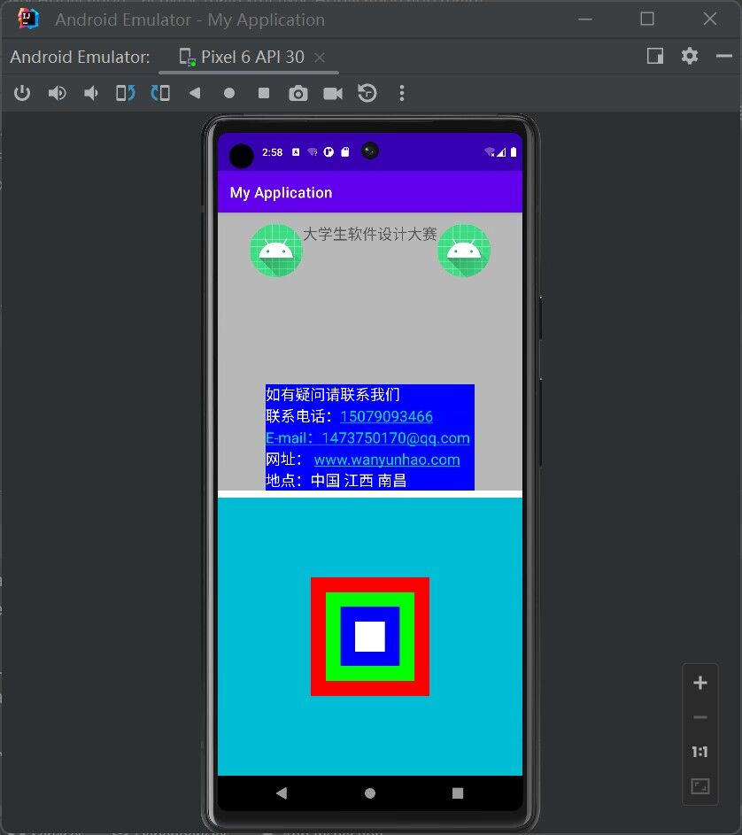

## 第一次作业

实现类似下图的效果；线性布局与嵌套布局的运用。




### 代码

创建好空白项目后，修改`activity_main.xml`即可。

```xml
<LinearLayout xmlns:android="http://schemas.android.com/apk/res/android"
              xmlns:app="http://schemas.android.com/apk/res-auto"
              xmlns:tools="http://schemas.android.com/tools"
              android:layout_width="match_parent"
              android:layout_height="match_parent"
              android:orientation="vertical"
              tools:context=".MainActivity">
    
    <LinearLayout
            android:layout_width="match_parent"
            android:layout_height="0dp"
            android:layout_weight="1"
            android:background="#B8B8B8"
            android:gravity="center_horizontal"
            android:orientation="vertical">

        <TextView
                android:layout_width="wrap_content"
                android:layout_height="wrap_content"
                android:drawableLeft="@mipmap/ic_launcher"
                android:drawableRight="@mipmap/ic_launcher"
                android:padding="15dp"
                android:drawablePadding="0dp"
                android:textSize="20sp"
                android:text="大学生软件设计大赛"/>
        <RelativeLayout
                android:layout_width="match_parent"
                android:layout_height="wrap_content">
            <TextView
                    android:layout_width="wrap_content"
                    android:layout_height="wrap_content"
                    android:layout_centerHorizontal="true"
                    android:background="#0000ff"
                    android:text="如有疑问请联系我们\n联系电话：15079093466\nE-mail：1473750170@qq.com\n网址： www.wanyunhao.com\n地点：中国 江西 南昌"
                    android:autoLink="all"
                    android:layout_alignParentBottom="true"
                    android:textColor="#ffffff"
                    android:textSize="20sp"/>
        </RelativeLayout>
    </LinearLayout >
    <FrameLayout
            android:layout_width="match_parent"
            android:layout_height="0dp"
            android:background="#00BCD4"
            android:layout_marginTop="10dp"
            android:layout_weight="1">
        <TextView
                android:layout_width="160dp"
                android:layout_height="160dp"
                android:background="#ff0000"
                android:layout_gravity="center"/>
        <TextView
                android:layout_width="120dp"
                android:layout_height="120dp"
                android:background="#00ff00"
                android:layout_gravity="center"/>
        <TextView
                android:layout_width="80dp"
                android:layout_height="80dp"
                android:background="#0000ff"
                android:layout_gravity="center"/>
        <TextView
                android:layout_width="40dp"
                android:layout_height="40dp"
                android:background="#ffffff"
                android:layout_gravity="center"/>
    </FrameLayout>
</LinearLayout>
```

